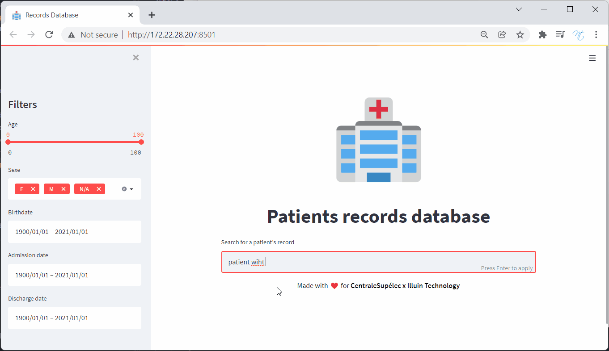

# Description

<p align="center">


</p>

This repository contains our code for a competition organised by Centrale Supelec and Illuin Technology. It is possible to learn more about the tasks by looking at the content of the folder `Explication dataset` or by looking at the final presentation in `presentation`.

The competitions contained 2 parts, the first contains 3 tasks of NER, NLI, text classification... and the second is the creation of a search engine capable of finding patients based on filters and a search Query.



# Mainly used technologies
 - Transformers library by HuggingFace
 - Scibert
 - Biobert
 - Electramed
 - MiniLM-L6
 - Streamlit
 - Flask
 - Annoy
# How to use 
## Evaluation
First, we need to download the submodule for evaluation :
```bash
$ git submodule init
$ git submodule update
```

## Build dataset
You can find the data here https://portal.dbmi.hms.harvard.edu/projects/n2c2-nlp/

First we need to have the initial data as follows :

```bash
medical_txt_parser
	├── Explication dataset/
	├── train_data/
		├── beth/
			├── ast/
				...
				└── record-13.ast
			├── concept
				...
				└── record-13.con
			├── rel
				...
				└── record-13.rel
			└── txt
				...
				└── record-13.txt
		└── partners/
			├── ast/
				...
				└── record-10.ast
			├── concept
				...
				└── record-10.con
			├── rel
				...
				└── record-10.rel
			└── txt
				...
				└── record-10.txt
	
	└── src/                
```

Then execute the following command to build the dataset from the root of the project:

```bash
$ ./src/data_merger.sh
```

To prepare the embeddings and clusters for the search API:
```bash
$ cd src
$ python -m clustering.prepare_embeddings
```

To launch the app, start in the root directory of the project by executing :
```
$ python src/api.py
$ streamlit run app/search_engine.py
```
